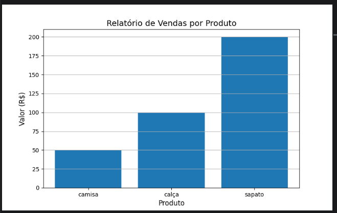
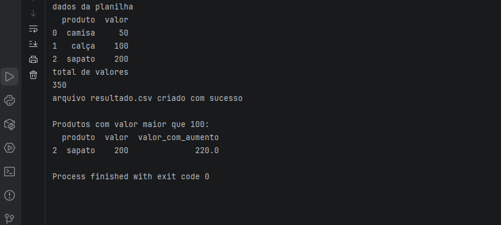

📊 Automação e Análise de Vendas com Python
🚀 Sobre o Projeto

Este projeto foi desenvolvido com o objetivo de aplicar conceitos de automação e análise de dados utilizando Python, simulando um cenário real de análise de vendas.

A aplicação realiza a leitura de dados, processamento, análise e geração de relatórios automatizados a partir de um arquivo .csv.

🎯 Objetivos do Projeto

Praticar Python na prática
Automatizar leitura e processamento de dados
Realizar análises simples de vendas
Gerar relatórios automatizados
Criar visualizações gráficas
🛠️ Tecnologias Utilizadas
Python
Pandas
Matplotlib
📁 Estrutura do Projeto
automacao-analise-vendas-python/
│
├── excel/
│   ├── vendas.csv
│   ├── resultado.csv
│   ├── produtos_caros.csv
│   └── grafico_vendas.png
│
├── main.py
└── README.md
⚙️ Funcionalidades

✔ Leitura de arquivo CSV
✔ Cálculo automático do total de vendas
✔ Criação de nova coluna com aumento de valores
✔ Geração de novo arquivo com dados atualizados
✔ Filtragem de produtos com valor acima de 100
✔ Exportação de dados filtrados
✔ Criação de gráfico de vendas
✔ Salvamento do gráfico como imagem

## 📊 Visualização do Projeto

### Gráfico de vendas

### Dados processados

▶️ Como Executar o Projeto

Clone o repositório:
git clone https://github.com/seu-usuario/automacao-analise-vendas-python.git
Acesse a pasta do projeto:
cd automacao-analise-vendas-python
Instale as dependências:
pip install pandas matplotlib
Execute o projeto:
python main.py
📚 Aprendizados

Durante o desenvolvimento deste projeto, foram aplicados conceitos importantes como:

Manipulação de dados com Pandas
Leitura e escrita de arquivos CSV
Estruturação de scripts Python
Filtragem e análise de dados
Criação de gráficos com Matplotlib
Automação de tarefas repetitivas

💡 Possíveis Melhorias Futuras
Interface gráfica com Streamlit
Integração com banco de dados
Automatização de envio de relatórios
Dashboard interativo

👩‍💻 Autora

Projeto desenvolvido por Tatiana Kamioka
